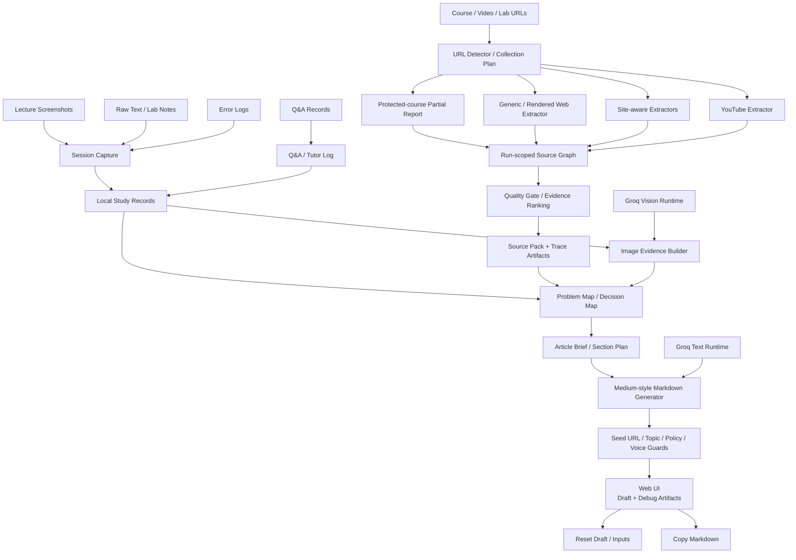
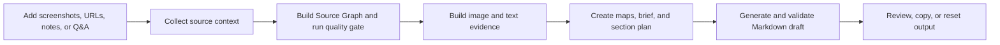

# AI Study Documentation Agent

**언어:** [English](./README.md) | 한국어

AI Study Documentation Agent는 흩어진 학습 기록을 구조화된 기술 글로 변환하는 학습 문서화 파이프라인입니다.

강의, 코딩 실습, 디버깅 과정에서는 스크린샷, URL, 메모, 에러 로그, Q&A가 서로 흩어지기 쉽습니다. 이 프로젝트는 그 기록을 세션 기반 evidence로 묶고, 문제 해결형 기술 노트와 블로그 초안으로 재구성합니다.

---

## Demo

- Live Demo: https://huggingface.co/spaces/onekindalpha/study-documentation-ai-agent

https://github.com/user-attachments/assets/1af3dd29-a7b9-49ec-b49d-a37b8e9443b2

가이드 영상은 학습 자료 입력, 글 생성 시작, source 수집·분석 대기, 생성된 Markdown 확인, 블로그 게시 준비까지의 흐름을 보여줍니다.

## Overview

이 프로젝트는 학습 과정의 판단 흐름을 보존하기 위해 만들었습니다.

스크린샷, 메모, 에러, 질문을 각각 따로 저장하는 대신 하나의 학습 세션으로 묶고, 이후 기술 문서로 재사용할 수 있도록 정리합니다.

목표는 단순 노트 저장이 아니라, 실제 학습 흔적을 다시 읽을 수 있는 기술 문서로 변환하는 것입니다.

---

## What It Does

이 프로젝트는 기술 학습 기록을 캡처에서 글쓰기까지 연결하는 workflow입니다.

사용자는 다음 작업을 할 수 있습니다.

- 스크린샷, 강의 URL, 메모, 에러 로그, Q&A 기록 수집
- 학습 기록을 capture 또는 session 단위로 정리
- 학습 URL을 분류하고 사이트 특성에 맞는 extractor로 연결
- public page, rendered site, course structure, YouTube transcript 기반 source context 수집
- 글 생성 전에 run 단위 Source Graph와 Source Pack 생성
- vision-capable LLM provider를 활용한 screenshot evidence 해석
- 학습 중 Q&A history 보존
- 문제 인식, 원인 분석, 조치, 검증, 결과 중심의 Medium-style 기술 글 초안 생성
- quality/topic guard를 통한 과거 주제 오염과 근거 부족 URL 글 차단
- 생성 결과를 Markdown으로 복사

이 서비스는 학습자의 판단을 대체하지 않습니다. 학습과 디버깅 과정에서 생긴 reasoning path를 보존하고, 나중에 기술 문서로 재구성할 수 있게 돕는 것이 목적입니다.

---

## Key Features

- Screenshot 기반 learning evidence reconstruction
- Universal learning-source URL detection과 extractor routing
- YouTube transcript, metadata, chapter, fallback enrichment
- Agent Academy, WikiDocs, Notion, Oopy, AI Skills Navigator, 일반 public page용 site-aware extraction
- 로그인/수강 권한이 필요한 source에 대한 protected-course partial report
- Run 단위 Source Graph, Source Pack, trace, quality-gate artifact
- Session-based capture timeline
- Q&A log와 tutor-style answer record
- Vision/fallback handling을 포함한 image evidence builder
- Problem map과 decision map generation
- Article brief와 section plan generation
- Medium-style Markdown draft generation
- Final draft validation을 위한 source-first, seed-URL, topic-lock, article policy / voice guard
- Collector report, capture, Q&A, evidence, map, plan, brief, critic 확인용 debug tabs
- Markdown copy 및 draft reset 지원

---

## Architecture

---

## System Flow

---

## Implementation Notes

- **Capture-first workflow**: screenshot, raw text, memo, source URL, Q&A를 개별 입력이 아니라 learning evidence로 처리합니다.
- **Session timeline**: 여러 capture와 Q&A log를 하나의 학습 세션으로 묶어 draft generation에 활용합니다.
- **Source collection**: URL detector가 YouTube, site-aware, protected-course, generic-web extractor를 선택합니다. 현재 YouTube, Microsoft Agent Academy, WikiDocs, Notion, Oopy, AI Skills Navigator, Inflearn/Udemy partial access, 일반 public page를 처리합니다.
- **Run isolation**: URL 생성 요청마다 별도 run ID와 output directory를 사용해 이전 Source Pack이 현재 글에 섞이지 않도록 합니다.
- **Source Graph / quality gate**: title, text, link, video, chapter, lab, code, access limitation을 Source Graph로 정규화하고, 글을 생성하기 충분한 근거인지 quality gate에서 판정합니다.
- **Vision-assisted evidence extraction**: screenshot을 visual learning evidence로 해석하고 caption, visible evidence, role, problem signal, technical entity로 정리합니다.
- **Problem reconstruction**: evidence를 problem map, decision map, article brief, section plan으로 재구성한 뒤 최종 article을 생성합니다.
- **Grounded draft generation**: captured evidence, source context, Q&A log, user note를 입력으로 사용합니다.
- **Final draft guard**: source-first check, seed-URL matching, topic lock, contamination detection, evidence coverage, article-policy check로 오래된 주제나 근거 없는 글을 최종 결과에서 차단합니다.
- **Fallback behavior**: source collection 또는 LLM generation이 불가능할 때 unsupported detail을 만들지 않고 안전한 fallback note를 반환합니다.

---

## Tech Stack

- Backend: Python standard library HTTP server
- Frontend: HTML, CSS, JavaScript single-page UI
- LLM runtime: Groq text generation과 Groq vision. provider-routing 설정은 존재하지만 현재 배포 client path는 Groq를 사용합니다.
- Source collection: Playwright, Crawl4AI, Trafilatura, `youtube-transcript-api`, `yt-dlp`, site-specific extractors
- Storage: local note, session, capture, run artifact, Source Graph, Source Pack, collector trace
- Output: Markdown draft generation

---

## Project Status

이 프로젝트는 실제 학습 evidence를 재사용 가능한 기술 문서로 변환하는 portfolio-stage prototype입니다.

현재 구현은 session capture, site-aware URL collection, Source Graph normalization, quality gating, evidence reconstruction, guarded draft generation, collector/debug inspection을 포함합니다.

향후 backend modularization, provider abstraction, asynchronous generation, persistent storage, export option, test coverage, public demo stability를 개선할 예정입니다.

---

## Roadmap

- backend를 더 작은 module로 분리
- browser-based capture flow 개선
- Markdown과 Notion export option 강화
- asynchronous job, progress streaming, transcript/source caching으로 생성 지연 단축
- provider-independent LLM client layer 완성
- collector, evidence processing, topic guard, draft generation regression test 확대
- public demo resource 안정화

---

## Development Notes

로컬 실행, 환경변수, API route, runtime data path, deployment note는 [DEVELOPMENT.md](./DEVELOPMENT.md)에 분리했습니다.

---

## Portfolio Context

이 레포는 AI service / documentation workflow portfolio project로 포지셔닝합니다.

보여주는 역량은 다음과 같습니다.

- session-based capture workflow 설계
- 학습 자료 기반 source context 수집
- site-aware collector, Source Graph, quality gate, run-isolated artifact 설계
- screenshot과 note를 structured learning evidence로 변환
- fragmented study record에서 problem-solving technical writing 생성
- incomplete, protected, weak source에 대한 안전한 fallback 처리
- capture, generation, debugging, copy, reset을 위한 browser-based UI 제공

---

## Honest Scope

이 프로젝트는 study capture, learning-source collection, evidence quality check, technical draft generation을 지원합니다.

하지 않는 것:

- protected course page 자동 접근
- caption이 비활성화되거나 제공되지 않는 영상의 완전한 transcript 보장
- 불완전한 source에서 정답 보장
- 게시 전 manual technical review 대체
- general-purpose autonomous browser agent
